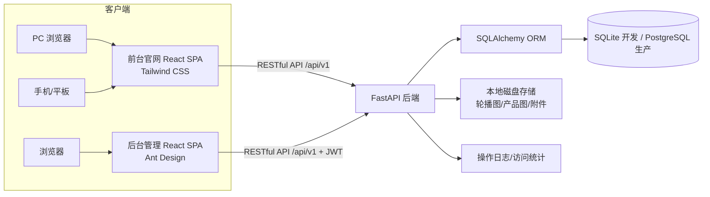
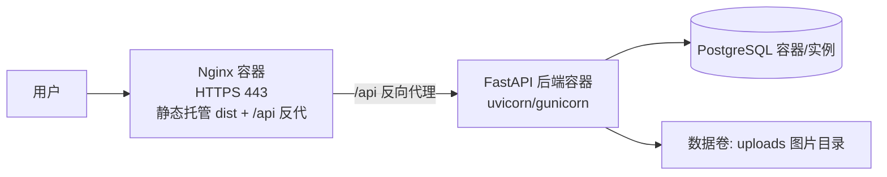

# TP智能家居企业官网及后台管理系统 产品需求文档（PRD）

| 项目名称 | TP智能家居企业官网 + 后台管理系统 |
|---|---|
| 文档版本 | V2.5（重新生成定稿版） |
| 文档状态 | 评审稿（待确认） |
| 编写日期 | 2026-08-17 |
| 参考网站 | https://www.lanniao.cn/（蓝鸟家具官网，仅作版式参考） |
| 技术栈 | Python + FastAPI + React + Tailwind CSS（前台）+ Ant Design（后台）；数据库：开发 SQLite / 生产 PostgreSQL |
| 设计风格 | 高端大气简约 |
| 交付物 | 本 PRD 文档（不包含代码实现） |

> 说明：
> 1. 网站名称与品牌主体统一使用「**TP智能家居**」；标注【待替换】的字段需由企业提供真实资料后替换。
> 2. 本版按用户新需求整体定稿：栏目结构重构（产品/新闻/招聘/关于/联系我们）、移除案例/荣誉/站内搜索/SEO 优化、前台样式改用 Tailwind CSS、首页启用轮播图并配套后台轮播图管理。
> 3. 数据库选型：开发环境 SQLite（免部署、零配置），生产环境 PostgreSQL 16.x；SQLAlchemy 2.x 同时兼容双方言。
> 4. 已同步交付配套 HTML 交互原型（前台 `prototype/index.html`、后台 `prototype/admin.html`），供 UI 评审参考；本版据此定稿轮播图主题联动跳转、水平时间线等交互细节（见 §5.2、§5.3.1、§5.3.5 及 §13 修订记录）。

---

## 1. 项目背景与目标

### 1.1 项目背景

企业为智能家居领域公司，需要建立统一的互联网品牌展示阵地，当前缺少可自主维护的企业官网：

- 官网信息陈旧、无法自主更新，内容发布依赖外部服务商；
- 产品、新闻、招聘、品牌等内容展示零散，缺乏统一的栏目体系和视觉规范；
- 无内容管理后台，运营人员无法自助维护；
- 移动端适配差，不符合当前主流访问习惯。

参考站（蓝鸟家具官网）提供了成熟的家具/家居企业官网版式范式：以品牌故事、产品系列、新闻资讯为核心内容，配合预约/咨询留资入口，面向消费者与合作伙伴传播品牌形象、承接线索。

### 1.2 项目目标

1. 建立统一、美观、可自主维护的品牌官网，以**高端大气简约**的设计风格塑造智能家居品牌形象；
2. 通过产品（信息+内容）、新闻（行业+产品）、招聘（行业+校园）、关于（品牌全貌）四大内容板块传递企业实力；
3. 通过首页**轮播图**展示品牌形象，通过**在线预约参观**与**留言咨询**承接线上线索，形成获客闭环；
4. 建设配套后台管理系统，使运营人员可自助完成内容发布（含轮播图配置）、预约/留言处理、数据查看等日常工作；
5. 采用前后端分离架构（FastAPI + React），保障可维护性与可扩展性。

### 1.3 非目标（本期明确不做）

- ❌ 在线交易（购物车 / 下单 / 在线支付）：仅"展示 + 预约/留言留资"，交易由线下跟进完成；
- ❌ 多语言版本：仅中文；
- ❌ SEO 优化：本期不做搜索引擎优化（不含动态 meta / sitemap / SSR / 预渲染），搜索引擎收录不在本期范围；
- ❌ 站内搜索：不提供搜索框，界面更简洁；
- ❌ 在线客服工具接入：不集成第三方客服系统；
- ❌ 会员注册登录体系：前台访客无需注册；
- ❌ 案例展示 / 荣誉资质栏目：本期不设独立栏目（品牌背书内容并入"关于"各子页）。

### 1.4 成功指标（建议）

| 指标 | 目标值 |
|---|---|
| 首页首屏加载时间（4G网络，PC） | ≤ 2s |
| 前台 API 接口 P95 响应时间 | ≤ 500ms |
| 月度预约参观线索量 | ≥ 15 条 |
| 月度留言咨询线索量 | ≥ 20 条 |
| 运营人员自助完成一次新闻发布（从登录到上线） | ≤ 10 分钟 |
| 运营人员自助更换首页轮播图（从登录到生效） | ≤ 5 分钟 |
| 预约/留言首次响应时效（提交→运营首次处理标记） | ≤ 24 小时 |

---

## 2. 产品定位与参考基准

### 2.1 参考网站分析（lanniao.cn）

对蓝鸟家具官网的栏目与页面结构拆解如下，作为本项目前台版式的参照基准：

| 板块 | 参考站内容 | 本项目映射 |
|---|---|---|
| 顶部导航 | 走进蓝鸟 / 产品系列 / 新闻资讯 / 关于我们 等 | 「首页 / 产品 / 新闻 / 招聘 / 关于 / 联系我们」 |
| 首页 Banner | 品牌形象大图轮播 | 保留并升级：轮播图后台可配置（§5.3.1、§6.4.1） |
| 品牌介绍区 | 企业简介 + 卖点卡片 | 保留，简介与卖点内容可配置 |
| 产品系列区 | 按系列分组展示产品卡片 | 对应「产品 > 产品信息」，系列与产品后台维护 |
| 新闻资讯区 | 最新新闻 3 条 + 更多入口 | 对应「新闻 > 行业新闻 / 企业新闻」 |
| 页脚 | 公司信息、联系方式、快捷链接、版权 | 保留 |

**页面类型归纳**：首页（Home）、栏目列表页（List）、内容详情页（Detail）、纯展示页（About）。本项目沿用该页面类型体系。

**视觉基调建议（高端大气简约）**：大面积留白、克制的高端配色（深色 + 金属/科技质感点缀，具体品牌主色待企业 VI 确认）、精致的大图与排版、克制的动效。落地以 UI 设计稿为准。

### 2.2 定制化差异（相对参考站）

| 差异点 | 说明 |
|---|---|
| 栏目重构 | 按企业定位定制：产品（信息+内容）、新闻（行业+产品）、招聘（行业+校园）、关于（下拉窗格 5 子页）、联系我们 |
| 在线预约 | 新增预约参观（展厅/工厂体验）表单，承接到店线索 |
| 招聘栏目 | 新增行业/校园招聘岗位展示（含投递邮箱） |
| 全站响应式 | 明确要求 PC/平板/手机自适应 |
| 前台样式 | 使用 Tailwind CSS 定制，实现高端大气简约风格 |
| 轮播图自助配置 | 首页轮播图由后台自助管理，无需依赖开发 |
| 无 SEO/搜索 | 按需求明确排除，保持界面简洁 |

---

## 3. 用户角色与使用场景

### 3.1 前台角色

| 角色 | 描述 | 核心诉求 |
|---|---|---|
| 消费者/意向客户 | 关注智能家居产品的个人用户 | 了解品牌与产品、预约参观、留言咨询 |
| 求职者 | 关注招聘岗位的行业/应届人才 | 查看招聘岗位、了解企业、邮箱投递 |
| 合作伙伴 | 关注招商/合作的企业或个人 | 了解企业实力、品牌介绍、联系洽谈 |

### 3.2 后台角色（RBAC）

| 角色 | 权限范围 | 说明 |
|---|---|---|
| 超级管理员 | 全部权限，含用户/角色管理与系统设置 | 1 个默认账号，不参与内容日常维护 |
| 内容编辑 | 内容管理全部（轮播图/产品/新闻/招聘/关于），可查看预约与留言 | 日常内容发布与维护 |
| 运营专员 | 内容只读、预约/留言处理与导出、数据统计查看 | 线索跟进与运营分析 |

### 3.3 核心使用场景

1. **访客了解产品**：进入官网 → 首页浏览轮播图与推荐产品 → 进入「产品 > 产品信息」按系列查看目录与规格参数 → 进入「产品 > 产品内容」查看图文详情。
2. **访客预约参观**：在「关于 > 在线预约」或首页预约入口填写表单（姓名、手机号、预约类型、期望日期/时段、备注 + 验证码）→ 提交成功 → 后台生成一条"待确认"预约。
3. **访客留言咨询**：在「联系我们」页填写留言表单 → 提交成功 → 后台生成一条"待处理"留言。
4. **求职者投递**：浏览「招聘 > 行业招聘/校园招聘」岗位 → 查看任职要求 → 通过页面展示的投递邮箱发送简历。
5. **运营维护轮播图**：登录后台 → 轮播图管理 → 新增/编辑/排序/启停 → 前台首页立即生效。
6. **运营处理预约**：后台预约列表查看新预约 → 详情确认（电话回访）→ 标记"已确认/已完成" → 定期导出 Excel 交销售跟进。
7. **管理员分配权限**：超级管理员新建角色、为管理员账号分配角色 → 控制各模块可见与操作范围。

---

## 4. 系统总体架构

### 4.1 技术选型（已确认）

| 层 | 选型 | 说明 |
|---|---|---|
| 前端框架 | React + TypeScript | 前后台统一技术栈 |
| 前端构建 | Vite | 开发热更新、生产构建 |
| 前台 UI | **Tailwind CSS** | 定制"高端大气简约"风格，不依赖组件库视觉 |
| 后台 UI | **Ant Design 5.x** | 后台管理系统组件库 |
| 前端路由/状态 | React Router（路由）+ Zustand（状态） | 轻量，满足 SPA 路由与全局状态需求 |
| 后端框架 | Python + FastAPI | 异步高性能，自动生成 OpenAPI 文档 |
| ORM | SQLAlchemy 2.x | 同时兼容 SQLite 与 PostgreSQL，开发/生产切换仅需改连接串 |
| 数据库 | SQLite（开发）/ PostgreSQL（生产） | 已确认：开发环境 SQLite 免部署零配置；生产环境 PostgreSQL 16.x |
| 认证 | JWT + RBAC | 账号密码登录 + 角色权限控制 |
| 图片存储 | 本地磁盘 | 已确认；预留对象存储（COS/OSS）切换接口 |
| 部署 | Docker + Nginx + Linux | 已确认 |
| 代码仓库 | Git +（建议 GitLab/GitHub） | 单仓库多应用（frontend / admin / backend） |

### 4.2 架构图



### 4.3 部署架构（生产环境）



- Nginx 单容器同时承担前端静态资源托管与 `/api` 反向代理（无独立静态服务器节点）；
- 前端构建产物（`dist`）由 Nginx 静态托管，路由级 history 回退配置；
- `/api/*` 请求反向代理至后端容器；
- PostgreSQL 生产环境使用独立容器（建议托管云数据库）；开发环境直接使用 SQLite 文件库，无需容器；
- 上传图片（含轮播图）挂载持久化数据卷，容器重建不丢数据。

---

## 5. 前台功能需求（TP智能家居官网）

### 5.1 信息架构

```
前台官网（SPA，响应式，高端大气简约）
├── 首页（/）
├── 产品（导航下拉）
│   ├── 产品信息（/products）—— 产品目录与规格参数列表
│   └── 产品内容（/products/content）—— 产品图文详情内容
│       └── 产品详情（/products/:id）
├── 新闻（导航下拉）
│   ├── 行业新闻（/news/industry）
│   └── 企业新闻（/news/company）
├── 招聘（导航下拉）
│   ├── 行业招聘（/jobs/industry）
│   └── 校园招聘（/jobs/campus）
├── 关于（导航下拉窗格，5 个子页）
│   ├── 关于AI（/about/company）—— 公司简介
│   ├── 发展历程（/about/history）—— 企业大事记时间轴
│   ├── 品牌历程（/about/brand-history）—— 品牌关键节点时间轴
│   ├── 品牌介绍（/about/brand）—— 品牌故事与理念
│   └── 在线预约（/about/appointment）—— 预约参观表单
├── 联系我们（/contact）
│   ├── 联系方式、地址、地图
│   └── 留言表单
└── 全站公共
    ├── 顶部导航（响应式折叠；产品/新闻/招聘/关于为下拉菜单）
    ├── 页脚（联系信息/快捷链接/版权/备案号）
    └── 侧边悬浮"预约参观/电话"浮层（链接到在线预约或拨打电话）
```

> 命名说明：「关于 > 关于AI」为原始命名，建议随品牌更名（如"关于我们/关于TP"），最终名称由企业确认【待替换】。

### 5.2 通用要求（全站）

| 编号 | 要求 |
|---|---|
| G-01 | 响应式布局：≥1200px（PC 多栏）、768–1199px（平板）、<768px（手机单栏、导航折叠为抽屉） |
| G-02 | 顶部导航在各页面保持统一；当前栏目高亮；下拉菜单 PC 端 hover/click 展开（**同一时刻仅展开一个，单例模式，点击其他栏目或页面空白处自动收起**），移动端展开为二级列表 |
| G-03 | 产品/新闻封面图懒加载；轮播图首图预加载、后续轮播图按需加载；轮播大图压缩后单张 ≤ 300KB |
| G-04 | 全局 404 页面、加载中/空状态提示 |
| G-05 | 前端只读接口无需登录；预约/留言提交做验证码 + 频率限制 |
| G-06 | 设计基调：高端大气简约——大留白、克制配色、大图、统一间距与字体层级（具体以 UI 设计稿为准） |
| G-07 | 本期不做 SEO 优化与站内搜索（见 §1.3 非目标） |

### 5.3 页面明细

#### 5.3.1 首页（/）

| 模块 | 说明 | 数据来源 |
|---|---|---|
| 顶部导航 | 全站统一 | 配置 |
| **轮播图（Banner）** | 3–5 张高端大气品牌大图；自动轮播（3–5s 可配置）+ 手动切换 + 指示点；支持点击跳转链接；**文案统一左对齐**；**CTA 与轮播主题联动：按主题跳转产品页并自动预选对应系列筛选（如"智能照明"主题 → 预选智能照明、"智能安防"主题 → 预选智能安防，跳转 URL 携带系列参数）**；移动端自适应高度 | **轮播图表（后台轮播图管理维护，§6.4.1）** |
| 品牌介绍区 | TP智能家居 简介摘要（2–3 句）+ 核心卖点图标卡（内容后台可编辑） | 关于管理/公司简介 |
| 产品推荐区 | 精选产品 6–8 个（勾选"首页推荐"的产品），卡片含图、名称、型号、系列；**顶部加分类筛选（默认"所有"，可按系列筛选：智能照明 / 智能安防 / 全屋智能；data-active 单选）** | 产品表 |
| 新闻动态区 | 最新行业/企业新闻 3–4 条（日期 + 标题 + 摘要）+ "更多"入口 | 新闻表 |
| 预约参观 CTA | 醒目入口按钮："预约参观"→ 跳转「关于 > 在线预约」 | 配置 |
| 页脚 | 公司名、地址、电话、邮箱、快捷链接、ICP 备案号、版权 | 系统设置/公司信息 |

#### 5.3.2 产品（产品信息 / 产品内容）

**产品信息页（/products）——产品目录与规格参数**

- 顶部/侧边系列筛选：默认"全部系列"，列出启用中的系列【待替换：如智能照明 / 智能安防 / 全屋智能等】；
- 产品目录卡片或表格：封面图、产品名称、产品编号（product_code）、所属系列、核心规格参数摘要（如尺寸、功率、材质等）；
- 点击产品 → 进入产品详情（产品内容）；
- 分页（每页 12 个，可配置）+ 排序（默认后台设置排序，支持按浏览量切换）；
- 空状态与无更多提示。

**产品内容页（/products/content）——产品图文详情**

- 产品内容页为"产品图文内容聚合浏览页"：按产品/系列分组展示图文详情区块（图文卡片），点击进入单个产品完整详情（/products/:id）；与"产品信息"（目录+规格参数视图）共用同一产品数据源；
- 产品详情页（/products/:id）：

| 模块 | 说明 |
|---|---|
| 图片区 | 封面大图 + 多图轮播/缩略图切换（详情图组） |
| 基本信息 | 名称、产品编号（product_code）、所属空间分类（category_id）、所属系列（series_id） |
| 规格参数 | 尺寸、材质、颜色/风格、适用空间、核心参数（后台"规格参数"以 `spec` JSON 结构化维护，表格展示，已吸收材质/尺寸/风格/空间/扩展属性） |
| **产品属性** | **扩展属性（key-value 列表，取自 `spec` 规格参数 JSON）**：保修期、产地、上市时间、认证 / 资质、包装清单、电源方式、适用面积 / 负载、光源 / 续航寿命、感应 / 检测参数等（**不同产品类型属性项不同，按产品类型在后台配置显示项**） |
| 产品内容 | 富文本图文详情（产品介绍、卖点、场景图） |
| **搭配使用** | **关联商品链接卡片区**：从其他产品中选取可与本品搭配的 2–4 个商品（**后台"产品管理"中通过"搭配产品"多选维护**），前台以链接卡片形式展示，**点击直接跳转对应产品详情页**；用于引导场景化购买 / 体验（如智能吸顶灯 Pro 搭配智能开关面板、智能窗帘电机） |
| 价格说明 | "价格面议/请咨询"文本，不展示真实价格 |
| 推荐产品 | 同系列其他产品 2–4 个 |
| 咨询入口 | "预约参观/留言咨询"按钮 → 跳转在线预约或联系我们表单 |

**产品字段（默认约定，可调整）**：空间分类（category_id）、系列（series_id）、产品编号（product_code，产品ID，业务唯一）、名称、封面图、详情图组（images，JSON 字符串数组）、规格参数（spec，JSON 键值，已吸收材质/尺寸/颜色风格/适用空间/扩展属性）、产品描述（description，富文本）、发布状态（pub_status：上架/下架/草稿）、是否首页推荐（is_top/置顶）、排序、浏览量、搭配产品（related_products，关联其他产品 ID 数组，2–4 个）、价格说明文本。

#### 5.3.3 新闻（行业新闻 / 企业新闻）

- 列表页：日期 + 封面 + 标题 + 摘要，分页；置顶新闻优先展示；按分类（**行业新闻 / 企业新闻**）分栏或筛选；
- 详情页：标题、发布时间、作者、来源（转载标注，原创留空）、正文（富文本，支持图文混排）、截止时间（下线时间，可空）、上一篇/下一篇（同分类内导航）；
- 浏览量统计并展示。

#### 5.3.4 招聘（行业招聘 / 校园招聘）

- 列表页：两个子栏目（行业招聘 / 校园招聘），岗位卡片/列表展示：岗位名称、类型标签、招聘人数、工作地点、薪资说明（可选）；
- 岗位详情页（/jobs/:id）：岗位职责、任职要求、投递邮箱（醒目展示）+ "邮箱投递"提示（复制邮箱/唤起邮件客户端）；
- 投递方式：**展示 + 邮箱投递**（不上传简历，由求职者邮件发送）；
- 分页 + 空状态。

**岗位字段**：分类（行业/校园）、岗位名称、招聘人数、工作地点、薪资说明（可选）、岗位职责、任职要求、投递邮箱、状态、排序。

#### 5.3.5 关于（下拉窗格 5 子页）

**关于AI（/about/company）—— 公司简介**

- 企业简介图文排版（文字 + 厂区/展厅实拍图），后台富文本维护；
- 实力数据化展示（成立时间、团队规模、产品线等，数字后台可配置）；
- 资质荣誉区块（可选展示）：企业资质/认证/荣誉证书图片墙，后台可维护（见 §6.4.5）。

**发展历程（/about/history）—— 企业大事记**

- **水平时间轴（从左到右）**展示企业发展大事记：年份 + 事件标题 + 描述；节点对齐中轴线、条目左右均分、支持横向滚动（移动端）；后台可维护条目。

**品牌历程（/about/brand-history）—— 品牌关键节点**

- **水平时间轴（从左到右）**展示品牌关键里程碑（品牌发布、产品迭代、重要合作等），与"发展历程"同款时间轴视觉；后台可维护条目。

**品牌介绍（/about/brand）—— 品牌故事与理念**

- 品牌定位、品牌故事、品牌理念/价值观图文板块，后台富文本维护。

**在线预约（/about/appointment）—— 预约参观**

| 模块 | 说明 |
|---|---|
| 预约表单 | 见下方字段定义 |
| 提交反馈 | 成功/失败 Toast 提示；提交后 3 秒内禁止重复提交 |
| 补充信息 | 预约须知（到店时间、联系方式说明），后台可配置文本 |

**预约表单字段**

| 字段 | 必填 | 校验规则 |
|---|---|---|
| 姓名 | 是 | 2–20 字符 |
| 手机号 | 是 | 11 位大陆手机号 |
| 预约类型 | 是 | 单选：展厅参观 / 工厂体验 |
| 期望日期 | 否 | 日期选择，不得早于今天 |
| 期望时段 | 否 | 单选：上午 / 下午 |
| 备注 | 否 | ≤ 200 字 |
| 验证码 | 是 | 图形验证码，4 位；失败 3 次后刷新 |
| 隐私提示 | - | 固定展示："您的信息仅用于预约联系，我们将严格保密，不作其他用途" |

#### 5.3.6 联系我们（/contact）

| 模块 | 说明 |
|---|---|
| 联系信息 | 公司地址、电话、邮箱、营业时间（后台维护，全站页脚同步引用） |
| 地图 | 静态地图/嵌入地图（建议腾讯地图，遵守合规要求） |
| 留言表单 | 见下方字段定义 |
| 提交反馈 | 成功/失败 Toast 提示；提交后 3 秒内禁止重复提交 |

**留言表单字段**

| 字段 | 必填 | 校验规则 |
|---|---|---|
| 姓名 | 是 | 2–20 字符 |
| 手机号 | 是 | 11 位大陆手机号 |
| 邮箱 | 否 | 邮箱格式 |
| 咨询类型 | 是 | 单选：产品咨询 / 合作洽谈 / 售后服务 / 其他 |
| 咨询内容 | 是 | 10–500 字 |
| 验证码 | 是 | 图形验证码，4 位；失败 3 次后刷新 |
| （隐藏）来源页面 | - | 自动记录当前页面/产品 ID（如来自产品详情页） |
| 隐私提示 | - | 固定展示："您的信息仅用于业务咨询联系，我们将严格保密，不作其他用途" |

---

## 6. 后台管理系统功能需求

### 6.1 总览

```
后台管理（/admin，独立 SPA，需登录）
├── 登录页
├── 工作台（Dashboard）
├── 内容管理
│   ├── 轮播图管理（首页 Banner）★ 用户重点需求
│   ├── 产品管理（系列管理 + 产品管理[信息/内容]）
│   ├── 新闻管理（行业新闻 / 企业新闻）
│   ├── 招聘管理（行业招聘 / 校园招聘）
│   └── 关于管理（关于AI / 发展历程 / 品牌历程 / 品牌介绍 / 资质荣誉 / 在线预约说明）
├── 预约管理（在线预约）
├── 留言管理
├── 系统管理
│   ├── 管理员管理
│   ├── 角色管理
│   └── 操作日志
├── 数据统计（访问 / 预约 / 留言）
└── 系统设置（网站名称、联系方式、备案号等）
```

### 6.2 登录与安全

| 编号 | 需求 |
|---|---|
| L-01 | 登录方式：用户名 + 密码 + 图形验证码 |
| L-02 | 密码 bcrypt 加密存储；JWT 有效期 8 小时，支持续期；登出使 token 失效（或客户端清除 + 服务端黑名单） |
| L-03 | 登录失败 5 次锁定账号 15 分钟；支持 IP 频率限制（防暴力破解） |
| L-04 | 默认超级管理员账号首次登录强制修改密码 |
| L-05 | 无权限菜单不展示、接口 403 兜底 |

### 6.3 工作台（Dashboard）

- 概览卡片：内容总量（轮播图/产品/新闻/招聘）、本月预约数、待确认预约数、待处理留言数；
- 最近 7 天预约与留言趋势图（折线图）；
- 快捷入口：新建产品 / 查看预约 / 管理轮播图。

### 6.4 内容管理

#### 6.4.1 轮播图管理（首页 Banner）★

| 功能 | 说明 |
|---|---|
| 列表 | 表格/卡片：缩略图、标题、跳转链接、排序、启停状态、更新时间、操作；支持状态筛选、分页 |
| 新增/编辑 | 图片上传（大图，建议 ≥ 1280 宽、推荐 1920×720 及以上，≤ 5MB，jpg/png/webp/gif）、标题（选填）、跳转链接（选填：站内页面或外链）、排序、启用/停用、起止时间（可选，超出自动隐藏） |
| 启停 | 停用后前台首页不再展示；若停用/删除操作将导致启用轮播图数量为 0，则阻止操作并提示（需先新增或启用其他轮播图） |
| 排序 | 拖拽或数字排序，前台按排序依次轮播 |
| 预览 | 保存前提供图片预览与前台首页效果预览 |
| 删除 | 软删除；删除已启用的轮播图需二次确认 |
| 生效 | 保存/启停后前台首页即时生效（接口实时读取） |

> 前台对应 §5.3.1 首页轮播图模块；数据表见 §7.2 banner 表。

#### 6.4.2 产品管理

**系列管理**

- 列表 / 新建 / 编辑 / 启用停用 / 排序；
- 字段：系列名称、封面图、描述、排序、启用/禁用（is_activate）。

**产品管理（产品信息 + 产品内容统一维护）**

- 列表：产品图、名称、产品编号、所属空间分类、所属系列、是否首页推荐、发布状态、浏览量、排序、操作；
- 筛选：按系列、按发布状态（pub_status）、按是否首页推荐；支持关键字搜索（名称/产品编号 product_code）；
- 新建/编辑：见 §5.3.2 产品字段定义；其中：
  - **产品信息**：名称、产品编号、空间分类、系列、封面图、规格参数（结构化键值表格，支持自定义参数项，已吸收材质/尺寸/颜色风格/适用空间/扩展属性）、价格说明；
  - **产品内容**：详情图组（多张，拖拽排序）+ 产品描述富文本（图文内容）；
  - **搭配产品**：从其他产品中多选 2–4 个作为搭配关联（双向可配置，前台"搭配使用"区以链接卡片展示）
- 操作：上架/下架（pub_status）、首页推荐开关（is_top）、复制、删除（软删除）、批量上下架（batch-status）。

#### 6.4.3 新闻管理

| 功能 | 说明 |
|---|---|
| 列表 | 表格：标题、分类（**行业新闻/企业新闻**）、发布状态、置顶、浏览量、发布时间、操作；支持分类/状态筛选、关键字搜索、分页 |
| 新建/编辑 | 标题（必填）、分类（行业新闻/企业新闻）、摘要、封面图上传、正文富文本（支持图片插入）、来源（转载标注，可空）、是否置顶、发布状态、截止时间（下线时间，可空） |
| 发布状态 | 草稿 / 已发布 / 已下线；草稿不对外展示 |
| 操作 | 发布、下线、置顶/取消置顶、删除（软删除）、批量删除 |

#### 6.4.4 招聘管理

| 功能 | 说明 |
|---|---|
| 列表 | 表格：岗位名称、分类（**行业招聘/校园招聘**）、人数、地点、状态、排序、操作；支持分类/状态筛选、分页 |
| 新建/编辑 | 分类、岗位名称、招聘人数、工作地点、薪资说明（可选）、岗位职责（富文本）、任职要求（富文本）、投递邮箱、状态、排序 |
| 操作 | 启用/停用、删除（软删除）、复制（方便同类岗位快速新建） |

#### 6.4.5 关于管理

| 子页 | 维护内容 |
|---|---|
| 关于AI（公司简介） | 简介正文（富文本）、实力数据（键值） |
| 发展历程 | 时间轴条目：年份、标题、描述（增删改排序） |
| 品牌历程 | 时间轴条目：年份、标题、描述（增删改排序） |
| 品牌介绍 | 品牌故事/理念正文（富文本）、图文板块 |
| 资质荣誉 | 资质/认证/荣誉证书条目：证书图、标题、获得时间（增删改排序，前台"关于AI"页展示） |
| 在线预约说明 | 预约须知文本（前台预约页展示） |

- 联系方式管理：地址、电话、邮箱、营业时间（供前台页脚与联系页共用）；
- 修改保存即前台生效；每次保存写操作日志。

### 6.5 预约管理

| 功能 | 说明 |
|---|---|
| 列表 | 姓名、手机号（列表脱敏展示，如 138\*\*\*\*1234，详情页可查看完整号码）、预约类型（展厅参观/工厂体验）、期望日期、状态、提交时间、操作；支持类型/状态/时间范围筛选、关键字搜索、分页 |
| 详情 | 完整信息 + 备注 + 来源页面 |
| 状态流转 | 待确认（默认）→ 已确认 → 已完成 / 已取消；支持处理备注；状态支持回退（如误操作可重新打开） |
| 导出 | 按筛选结果导出 Excel（.xlsx） |
| 其他 | 删除（软删除）、批量标记状态（已确认/已取消）；新预约到达时后台角标提醒 |
| 权限 | 内容编辑可查看；运营专员可查看/处理/导出 |

### 6.6 留言管理

| 功能 | 说明 |
|---|---|
| 列表 | 姓名、手机号（列表脱敏展示，如 138\*\*\*\*1234，详情页可查看完整号码）、咨询类型、内容摘要、来源页面、状态、提交时间、操作；支持状态/类型/时间范围筛选、关键字搜索、分页 |
| 详情 | 完整信息 + 来源页面（产品详情页则显示产品名称/型号） |
| 状态流转 | 待处理（默认）→ 已处理 → 已关闭；支持处理备注；状态支持回退 |
| 导出 | 按筛选结果导出 Excel（.xlsx） |
| 其他 | 删除（软删除）、批量标记已处理；新留言到达时后台角标提醒 |
| 权限 | 内容编辑可查看；运营专员可查看/处理/导出 |

### 6.7 系统管理

#### 6.7.1 管理员管理

- 列表：用户名、中文名、英文名、部门、岗位、角色、启用/禁用、最后登录时间、创建时间；
- 操作：新建管理员（用户名 + 初始密码）、编辑（姓名/部门/岗位/角色等）、启用/停用（is_activate）、重置密码、删除（不可删除自己与最后一个超级管理员）；
- 一个管理员持有**单一角色**（`sys_user.role_id` 指向 `sys_role`）；权限取该角色权限集合（不再支持多角色并集）。

#### 6.7.2 角色管理（RBAC）

- 权限模型：用户持有单一角色（`sys_user.role_id` → `sys_role`），角色与权限多对多（`sys_role_permission`）；**原 `sys_user_role`（用户-角色多对多）已移除**，不再支持一个用户绑定多角色；
- 权限粒度：模块级 + 操作级，操作码示例：`news:*`、`product:*`、`job:*`、`about:*`、`banner:*`、`appointment:view`（查看）、`appointment:handle`（处理/回退）、`appointment:export`（导出）、`message:view` / `message:handle` / `message:export`、`user:*`、`role:*`、`log:view`、`stat:view`、`setting:*`；
- 角色 CRUD：角色名称、角色编码（code，机器键）、描述、勾选权限树、启用/禁用（is_activate）；
- 预置角色：超级管理员（全部）、内容编辑、运营专员（见 §3.2），允许自定义。

#### 6.7.3 操作日志

- 记录范围：登录/登出、内容增删改（含轮播图变更）、预约/留言状态变更、权限变更、系统设置修改等关键操作；
- 字段：操作人、模块、动作、详情描述、IP、时间；
- 支持按操作人/模块/时间范围查询；日志只读，保留 180 天。

### 6.8 数据统计

| 模块 | 说明 |
|---|---|
| 访问统计 | 每日 PV（按页面路由计数），7 天/30 天趋势图、Top10 页面排行；实现方式：后端中间件统计 + 每日聚合 |
| 预约统计 | 按类型、按状态、按时间维度统计，图表展示 |
| 留言统计 | 按类型、按状态、按时间维度统计，图表展示 |
| 数据导出 | 统计报表支持导出 Excel |

### 6.9 系统设置

- 网站名称、Logo、ICP 备案号、版权文案；
- 联系方式（与关于管理共用数据源）；
- 页脚快捷链接维护；
- 轮播图默认轮播间隔等展示参数（可选）。

---

## 7. 数据模型设计（核心表）

> 以下为 PRD 级表设计，供技术团队据此产出正式 DDL；字段以最终数据库设计为准。
>
> **类型映射说明（双库兼容）**：文中字段类型为逻辑表述（如 varchar/tinyint/datetime/JSON），落地时按目标库映射：SQLite 用 TEXT/INTEGER/REAL/JSON 兼容；PostgreSQL 用 VARCHAR/INTEGER/SMALLINT/TIMESTAMP/JSONB。SQLAlchemy 2.x 类型（如 String/Integer/DateTime/JSON）可自动适配双方言，开发/生产切换仅改连接串。

### 7.1 系统与权限

**sys_user（管理员账号）**

> 重构为组织化账号：登录名 + 中/英文名 + 部门 + 单一角色 + 岗位。本表不软删，停用走 `is_activate=0`（保留审计轨迹）。登录失败锁定（L-03）的 `fail_count`/`locked_until` 不再落本表，改由应用层/Redis 记录（见 Dev Spec §9）。

| 字段 | 类型 | 说明 |
|---|---|---|
| id | bigint PK | 管理员 ID |
| username | varchar(50) UK | 登录名，唯一 |
| password_hash | varchar(100) | bcrypt 密文 |
| cn_name | varchar(64) | 中文名 |
| en_name | varchar(64) | 英文名 |
| dept_id | bigint FK | 部门编号（→ department.id，SET NULL） |
| gender | varchar(8) | 男 / 女 / 保密 |
| phone / email | varchar | 联系方式 |
| position | varchar(64) | 岗位 |
| role_id | bigint FK | 角色编号（单一角色，→ sys_role.id，SET NULL） |
| （公共字段） | — | id / is_activate / created_at(人) / created_date(时间) / update_at(人) / update_date(时间)，见 §7.4 |

**department（部门）** ｜ **sys_role / sys_permission / sys_role_permission**

- department：id、dept_name（部门名称）、parent_id（上级部门，自关联，顶级 NULL）；
- sys_role：id、code(UK，机器键如 `super_admin`)、name（角色名称，展示用）、description；停用走 `is_activate`，不再用 `status`；
- sys_permission：id、name、code（如 `banner:update`、`appointment:handle`）、type（menu/action）、parent_id、sort；
- 关联表：仅保留 `sys_role_permission`（role_id ↔ permission_id，多对多）；**原 `sys_user_role`（用户-角色多对多）已移除**——用户经 `sys_user.role_id` 持有单一角色。

### 7.2 内容表

> 公共字段（全部表统一，见 §7.4）：`id` / `is_activate` / `created_at`(创建人) / `created_date`(创建时间) / `update_at`(修改人) / `update_date`(修改时间)；内容表（`banner` / `product_series` / `product` / `news` / `job` / `about_timeline`）额外含 `deleted_at`（软删）。键值表（`product_category` / `about_info` / `company_info`）不软删，停用走 `is_activate=0`。

**product_category（空间分类，V1.2 新增）**：id、name（分类名称，如 客厅，UK 唯一）、parent_id（上级分类，自关联，顶级 NULL）、sort（排序）。

**banner（轮播图）**：id、title（标题，选填）、image（图片）、link_url（跳转链接，可空）、start_at、end_at（可空，超出自动隐藏）、sort、is_activate（启用/停用，替代原 status）、deleted_at（软删）。

**product_series（产品系列）**：id、name（系列名称，如 智能照明）、cover_image、description、sort、is_activate（替代原 status）、deleted_at（软删）。

**product（产品，信息+内容一体，V1.2 重构）**：id、category_id（所属空间分类，FK→product_category，SET NULL）、series_id（所属系列，FK→product_series，SET NULL）、product_code（产品编号/产品ID，UK 唯一，如 TP-CL-001）、name（名称）、description（产品描述，富文本；原 content→description）、spec（JSON 规格参数键值，已吸收材质/尺寸/风格/空间/扩展属性）、cover_image、images（JSON 其他图片 url 数组）、pub_status（发布状态：on_shelf 上架 / off_shelf 下架 / draft 草稿）、is_top（置顶/首页推荐，原 is_recommend→is_top）、sort、views（浏览量）、related_products（JSON 搭配产品 ID 数组，2–4 个，前台"搭配使用"）、price_desc（价格说明文本，不存真实价格）、deleted_at（软删）。
> 归并说明：原 `model`→`product_code`、`is_recommend`→`is_top`、`content`→`description`；原 `material`/`size`/`color_style`/`scene`/`attrs` 并入 `spec`(JSON) 与 `description`(富文本)；原启用/停用 `status`→`pub_status`(发布工作流)。

**news（新闻，V1.2 重构）**：id、category（industry 行业新闻 / company 企业新闻，原 product 产品新闻并入 company）、title、cover_image、summary（摘要）、content（正文，富文本）、source（来源/转载标注，可空）、author、is_top（是否置顶）、views（浏览量）、sort、pub_status（是否发布：draft 草稿 / published 已发布 / offline 已下线，原 status→pub_status）、published_at（发布时间）、expired_at（截止时间/下线时间，可空）、deleted_at（软删）。

**job（招聘岗位）**：id、category（industry 行业招聘 / campus 校园招聘）、title（岗位名称）、count（招聘人数）、location（工作地点）、salary_desc（薪资说明，可空）、duty（岗位职责，富文本）、requirement（任职要求，富文本）、email（投递邮箱）、sort、is_activate（启用/停用，原 status 已并入 is_activate）、deleted_at（软删）。

**about_info（关于各子页内容，键值/富文本，键值表不软删）**：id、page_key（company_intro / brand_intro / appointment_notice 等，UK 唯一）、content（富文本 JSON）。

**about_timeline（发展历程 / 品牌历程条目）**：id、type（history 发展历程 / brand_history 品牌历程）、year、title、description、sort、deleted_at（软删）。

**company_info（联系方式等公共信息，键值表不软删）**：id、info_key（UK 唯一，address/phone/email/business_hours 等）、info_value、remark。

### 7.3 业务表

**appointment（在线预约）**：id、name、phone、appt_type（展厅参观 / 工厂体验）、appt_date（期望日期，可空）、appt_slot（期望时段：上午/下午，可空）、remark、source_page（来源页面，可空）、status（pending 待确认 / confirmed 已确认 / completed 已完成 / cancelled 已取消）、handle_remark、handler_id、handled_at、ip、is_activate（记录启用/禁用，作废线索置 0 而非硬删）、公共字段（见 §7.4）。

**message（留言）**：id、name、phone、email、type（咨询类型）、content、source_page（来源）、product_id（可空）、status（pending/processed/closed）、handle_remark、handler_id、handled_at、ip、is_activate（记录启用/禁用，作废走 is_activate=0）、公共字段（见 §7.4）。

**operation_log（操作日志）**：id、user_id、username、module、action、detail、ip、created_date（该表只增不改，按月分区可选项）、公共字段（见 §7.4）。

**visit_stat（访问统计，每日聚合）**：id、stat_date、path、pv（stat_date+path 唯一，便于 upsert 累加）、公共字段（见 §7.4）；或简化方案：visit_log 明细 + 每日聚合任务。

### 7.4 通用约束（公共字段统一约定，V1.2）

- **全部 19 张表统一公共字段**：`id`（bigint PK）/ `is_activate`（SMALLINT/INTEGER，1 启用 / 0 禁用，记录级总开关）/ `created_at`（创建人，存登录名或姓名）/ `created_date`（创建时间，时间戳）/ `update_at`（修改人）/ `update_date`（修改时间，由触发器或 ORM 自动刷新）。
- **软删除**：内容表（`banner` / `product_series` / `product` / `news` / `job` / `about_timeline`）含 `deleted_at`（软删，查询恒加 `deleted_at IS NULL`）；业务表 `appointment` / `message` 不硬删、作废线索走 `is_activate=0`（保留线索便于审计，详见数据库设计文档 §4.3）；键值表与权限域表（`product_category` / `about_info` / `company_info` / `department` / `sys_*`）不软删，停用走 `is_activate=0`。
- **启用/禁用统一**：原分散的"启用/停用类 status"已并入 `is_activate`；仅 `appointment` / `message` / `news` 保留业务 `status`（工作流：待确认/已处理等），与 `is_activate`（记录总开关）并存、职责不同。
- **命名约定**：本版 `created_at`=创建人、`created_date`=创建时间、`update_at`=修改人、`update_date`=修改时间（`_at` 表人、`_date` 表时间，与传统 `created_at`/`updated_at` 为时间戳相反）。建议新项目改用 `created_by`/`created_at`/`updated_by`/`updated_at` 以避免语义冲突（详见数据库设计文档 §4.0 / §8）。
- 字符编码 UTF-8（SQLite / PostgreSQL 均默认支持）；金额/价格不在本期出现（价格面议，仅存 `price_desc` 文本）；
- 外键约束适度使用，软删除业务建议逻辑校验替代硬外键：`product.category_id` / `product.series_id` / `sys_user.dept_id` / `sys_user.role_id` 为软外键（SET NULL），`sys_role_permission` 用 ON DELETE CASCADE；由技术团队定。

---

## 8. 非功能需求

### 8.1 性能

| 编号 | 要求 |
|---|---|
| P-01 | 前台首页首屏 ≤ 2s（4G、PC，图片压缩后） |
| P-02 | 列表类 API 分页上限 50/页，P95 响应 ≤ 500ms |
| P-03 | 支持 ≥ 100 并发访问不降级 |
| P-04 | 图片资源缓存头策略；Nginx 开启 gzip、静态缓存 |

### 8.2 安全

| 编号 | 要求 |
|---|---|
| S-01 | 密码 bcrypt；JWT 过期与刷新；接口级权限校验（越权返回 403） |
| S-02 | 预约/留言表单图形验证码 + 同 IP 10 分钟限 1 条 双保险（验证码与频率限制同时生效） |
| S-03 | SQL 预编译（ORM 参数化）；富文本内容 XSS 过滤（后端入库前清洗）；输出转义 |
| S-04 | 上传白名单：jpg/png/webp/gif，≤ 5MB；存储路径重命名（UUID），防路径穿越；轮播图建议限制最小尺寸（≥ 1280 宽，推荐 1920×720 及以上）以保证效果 |
| S-05 | 全站 HTTPS；敏感操作（删除、权限变更）二次确认 |
| S-06 | 统一异常处理，不向客户端泄露堆栈与 SQL 信息 |
| S-07 | 个人信息保护（《个人信息保护法》）：预约/留言仅收集业务必需字段（最小化）；表单展示隐私提示；后台列表手机号脱敏、详情页可查看；明确数据留存期限，支持按需删除 |

### 8.3 兼容性与可用性

- 浏览器：Chrome / Edge / Firefox / Safari 近两个大版本 + 微信内置浏览器；
- 响应式断点：≥1200 / 768–1199 / <768；
- 可访问性：图片 alt、表单 label、键盘可操作（基础 WCAG 2.1 AA 尽力而为）。

### 8.4 可维护性与扩展性

- 前后端分离、接口版本化（/api/v1）；
- 图片存储抽象接口，便于切换对象存储；
- 内容表预留扩展字段（JSON），便于后续加字段不迁移大表；
- 代码规范 + OpenAPI 文档自动生成（FastAPI 自带 Swagger UI，联调友好）。

### 8.5 数据备份

- PostgreSQL（生产）：每日增量备份、每周全量备份，保留 30 天，备份文件异地存放；开发环境 SQLite 库文件定期复制备份；
- 上传图片目录（含轮播图）：随全量备份周期打包。

---

## 9. 部署方案

### 9.1 环境规划

| 环境 | 用途 | 说明 |
|---|---|---|
| dev | 本地开发 | 默认 SQLite 文件库直连（免容器），uvicorn 热重载；如需可 Docker Compose 起 PostgreSQL 联调 |
| test | 联调验收 | 与生产同构 |
| prod | 生产 | Linux + Docker Compose（或 K8s，视规模） |

### 9.2 容器编排（Docker Compose，生产建议）

| 服务 | 镜像/说明 |
|---|---|
| web | Nginx：托管前端 dist + 反代 /api → backend；配置 gzip、缓存、HTTPS 证书挂载 |
| backend | Python 3.12 + FastAPI，uvicorn/gunicorn 多 worker；挂载 uploads 数据卷 |
| postgres | PostgreSQL 16.x：独立容器（生产建议托管云数据库），数据卷持久化；开发环境用 SQLite，无需容器 |
| 可选 | Redis（后续如需缓存/限流分布式化） |

### 9.3 上线要点

1. 域名 + HTTPS 证书（Let's Encrypt 或云厂商证书）；
2. Nginx 配置：SPA history 回退（`try_files ... /index.html`）、`/api` 反代、静态资源缓存头；
3. 数据库初始化脚本与初始数据（默认超级管理员、预置角色、示例轮播图与栏目数据）；
4. 备份任务（cron 每日/每周）与恢复演练；
5. 上线后监控：日志采集（访问/错误）、接口健康检查（/healthz）、告警（CPU/内存/磁盘）。

---

## 10. 里程碑与交付计划

> 周期按 1 个 5–6 人小组估算（2 前端 + 2 后端 + 1 设计 + 1 测试），可按实际团队调整。

| 阶段 | 内容 | 周期（建议） | 交付物 |
|---|---|---|---|
| M1 需求与设计 | PRD 评审、信息架构、UI 设计稿（高端大气简约） | 1–2 周 | PRD、UI 稿 |
| M2 基础框架 | 双环境数据库 DDL（SQLite/PostgreSQL）、前后端工程搭建、CI 基础 | 1 周 | 工程骨架 |
| M3 后台开发 | 登录/RBAC、内容管理（含轮播图管理）、预约/留言管理、统计日志 | 3–4 周 | 后台可用版本 |
| M4 前台开发 | 全部前台页面（首页轮播图、产品、新闻、招聘、关于、联系我们）+ 响应式 | 3–4 周 | 前台可用版本（与 M3 并行） |
| M5 联调测试 | 接口联调、功能/兼容/安全测试、内容录入 | 2 周 | 测试报告 |
| M6 上线 | 部署、数据初始化、备份、监控、培训 | 1 周 | 上线验收单 |

**验收标准**：前台栏目齐全、首页轮播图可后台自助配置并即时生效、响应式达标、后台各模块可用、权限隔离正确、预约/留言闭环打通、上线后稳定性观测 2 周无重大缺陷。

---

## 11. 风险与开放事项

### 11.1 风险清单

| 风险 | 影响 | 应对 |
|---|---|---|
| 品牌图片/内容素材（轮播大图、产品实拍、品牌介绍图）不足 | 首页与详情页效果打折 | 提前盘点素材，缺图阶段用占位图，上线前补齐；轮播图建议提供高清大图 |
| 富文本 XSS 与上传安全 | 安全风险 | 后端清洗 + 白名单校验，安全测试纳入验收 |
| 需求范围蔓延（如后续要电商/在线支付） | 排期风险 | 架构预留（产品表、权限模型），本期明确非目标 |
| 旧站数据迁移（如有） | 迁移成本 | 明确迁移范围与责任人，纳入 M6 |
| 「关于AI」等栏目命名与品牌调性不符 | 品牌一致性 | 上线前由企业确认栏目最终命名（§5.1 标注） |
| SQLite/PostgreSQL 方言差异（类型、JSON、日期函数等） | 开发/生产行为不一致 | ORM 层避免方言专属语法；CI 增加 PostgreSQL 环境测试；上线前双库冒烟 |

### 11.2 默认约定（未经逐条确认，请一并确认）

撰写本 PRD 时，以下细节按合理默认处理，如无异议按此执行：

1. 登录方式：账号密码 + 图形验证码 + JWT；
2. 轮播图：前台 3–5 张、自动轮播 3–5s 可配置、支持跳转链接；后台轮播图管理模块提供增删改/排序/启停/起止时间（§5.3.1、§6.4.1）；
3. 预约表单字段：姓名 / 手机号 / 预约类型（展厅参观、工厂体验）/ 期望日期（选填）/ 期望时段（选填：上午/下午）/ 备注（选填）/ 验证码（§5.3.5）；
4. 留言表单字段：姓名 / 手机号 / 邮箱（选填）/ 咨询类型 / 内容 / 验证码（§5.3.6）；
5. 产品字段：系列、名称、型号、封面图、图组、规格参数、**扩展属性（JSON 键值，按产品类型配置显示项）**、**搭配产品（关联产品 ID 数组，2–4 个）**、材质、尺寸、颜色风格、适用空间、价格说明文本、产品内容富文本（§5.3.2）；
6. 新闻分类预置：行业新闻 / 企业新闻；招聘分类预置：行业招聘 / 校园招聘（均可在后台维护）；
7. 图片限制：jpg/png/webp/gif，≤ 5MB，本地存储；轮播图建议 ≥ 1280 宽（推荐 1920×720 及以上）；
8. 预约/留言频率限制：同 IP 10 分钟 1 条 + 验证码；
9. 操作日志保留 180 天；内容软删除；
10. 访问统计采用后端 PV 计数 + 每日聚合；
11. 预约/留言表单展示隐私提示文案，后台手机号脱敏展示（§5.3.5、§5.3.6、§8.2 S-07）；
12. 本期不做 SEO 优化与站内搜索（§1.3 非目标）；
13. 产品内容页（/products/content）为产品图文内容的聚合浏览页，点击进入单个产品完整详情 /products/:id（§5.3.2）；
14. 预约/留言数据保留 24 个月，超期归档并可按需删除（配合 §8.2 S-07）；
15. 后台预约/留言"关键字搜索"支持按姓名、手机号模糊匹配（§6.5、§6.6）。

### 11.3 需企业后续提供（【待替换】资料清单）

- 企业真实品牌资料：Logo、品牌 VI 色、公司简介、品牌故事、发展/品牌历程条目；
- 轮播图高清大图（3–5 张，高端大气风格）；
- 产品系列分类、产品清单、规格参数与实拍图；
- 新闻初始内容、招聘岗位信息（含投递邮箱）；
- 联系方式（电话/邮箱/地址/地图坐标）、备案主体信息；
- 栏目最终命名确认（尤其"关于AI"）。

---

## 12. 附录：参考站页面清单（lanniao.cn）

| 页面 | URL | 借鉴点 |
|---|---|---|
| 首页 | https://www.lanniao.cn/ | 栏目布局、轮播 Banner、产品区、新闻区 |
| 走进蓝鸟 | /index/index/channel.html?id=2 | 品牌介绍与卖点呈现 |
| 产品列表 | /index/index/channel.html?id=6 | 系列分组、产品卡片 |
| 产品详情 | /index/index/productView.html?id=46 | 产品图 + 参数 |
| 新闻列表/详情 | /index/index/channel.html?id=10、newsView | 资讯排版 |

---

## 13. 修订记录

| 版本 | 日期 | 修订内容 |
|---|---|---|
| V2.5 | 2026-08-17 | 初始定稿 |
| V2.5.1 | 2026-08-17 | 原型评审后同步：① §5.3.1 轮播图 CTA 与主题联动（按系列预选跳转）、轮播文案统一左对齐；② §5.2 G-02 下拉菜单单例展开（同一时刻仅一个）；③ §5.3.5 发展历程 / 品牌历程由通用"时间轴"明确为**水平时间轴（从左到右）**；④ 表头说明补充配套 HTML 交互原型交付（前台 `prototype/index.html`、后台 `prototype/admin.html`） |
| V2.5.2 | 2026-08-17 | 原型迭代后同步：① §5.3.1 首页精选产品增加**分类筛选**（默认"所有"，按系列筛选：智能照明 / 智能安防 / 全屋智能，data-active 单选）；② §5.3.2 产品详情页增加**产品属性**区块（key-value 扩展属性，按产品类型配置）+ 新增**搭配使用**区块（关联商品链接卡片，点击跳转对应产品详情）；③ §5.3.2 产品字段、§6.4.2 产品管理、§7.2 product 表、§11.2 默认约定 同步增加 **attrs（JSON 扩展属性键值）** 与 **related_products（JSON 关联产品 ID 数组）** 字段 |

*本文档为评审稿。请确认后按版本管理基线冻结；后续变更走变更评审流程。*
