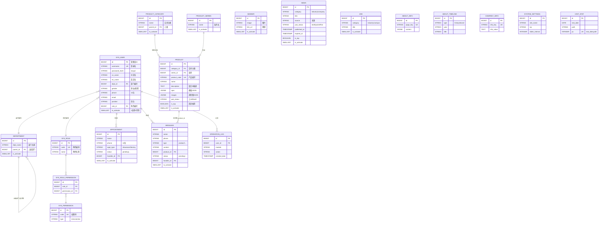

# TP智能家居企业官网 + 后台管理系统 · 数据库设计文档

| 文档版本 | V1.2（更新版） |
|---|---|
| 编写日期 | 2026-08-18 |
| 关联文档 | `企业家居官网PRD.md`（需求权威，V2.5）· `dev-spec/开发技术文档.md`（工程权威，V1.0） |
| 数据库 | SQLite（开发）/ PostgreSQL 16.x（生产） |
| 交付物 | 本文档（ER 图 + 数据字典 + 建表 SQL）+ `dev-spec/db-design/` 下 `er-*.svg`、`schema.postgres.sql`、`seed.sql` |

> 本文档把 PRD §7 的「PRD 级表设计」与 Dev Spec §5 的「SQLAlchemy 模型骨架」收敛为可交付开发的数据库落地规范。凡与 PRD/Dev Spec 冲突，以对应权威文档为准；本文档新增技术决策以「【设计】」标注。
>
> **V1.1 更新摘要**：① 新增 `department` 部门表（`dept_name` + `parent_id` 自关联）；② `sys_user` 重构为「登录名 + 中/英文名 + 部门编号 + 性别 + 手机号 + 邮箱 + 岗位 + 单一角色编号」，并移除 `sys_user_role`（多对多 → 用户持有单一 `role_id`）；③ `sys_role` 改为 `code`(机器键) + `name`(角色名称)；④ **全部 18 张表补齐公共字段**（主键、`is_activate`、`created_at`/`created_date`/`update_at`/`update_date`）。
>
> **V1.2 更新摘要**：① 新增 `product_category`（空间分类）表，承载 `product.category_id`；② `product` 重构：新增 `category_id`/`product_code`(产品编号/产品ID)/`pub_status`(发布状态 上架/下架/草稿)，`content`→`description`(富文本产品描述)、`is_recommend`→`is_top`(置顶/首页推荐)、`model`→`product_code`，原 `material`/`size`/`color_style`/`scene`/`attrs` 并入 `spec`(JSON 规格参数)+`description`(富文本)；③ `news` 重构：`category` 取值改为 `industry`(行业新闻)/`company`(企业新闻)，新增 `source`(来源/转载标注) 与 `expired_at`(截止时间)，`status`→`pub_status`(是否发布 草稿/已发布/已下线)；④ 表总数 18 → 19（含 `product_category`）。**ER 图已同步重生成（V1.2 结构）：总览含 product_category、内容域补产品→空间分类关系、product/news 框内字段已更新。**

---

## 1. 文档说明与范围

### 1.1 三文档关系

| 文档 | 角色 | 本文档如何引用 |
|---|---|---|
| PRD（V2.5） | 需求权威 | 功能边界、字段、权限码、枚举取值以 PRD 为准 |
| Dev Spec（V1.0） | 工程权威 | 接口契约、双库兼容、种子结构以 Dev Spec 为准 |
| **本文档** | 数据落地权威 | 在二者之上给出 ER 图、数据字典、可运行 DDL 与约束 |

### 1.2 覆盖范围

- 19 张表的实体关系（ER 图：总览 + 权限/系统域 / 内容域 / 业务域分域图）；
- **公共字段规范**（§4.0，全部表统一）与逐表数据字典；
- PostgreSQL 16.x 建表 DDL（主）、SQLite 差异说明、种子数据 SQL；
- 索引 / 约束 / 性能建议、安全合规要点、设计决策与待确认事项。

### 1.3 双库兼容约定（来自 PRD §7.4 / Dev §5）

- 逻辑类型 → 物理类型映射：**varchar→VARCHAR**、**tinyint/smallint→SMALLINT**、**int→INTEGER**、**bigint→BIGSERIAL(PK)/BIGINT**、**datetime→TIMESTAMP**、**JSON→JSONB(PostgreSQL) / TEXT(SQLite)**。
- 字符集：UTF-8（两库默认支持）。
- 开发期 `Base.metadata.create_all()` 快速建表；生产走 `alembic upgrade head`（Dev §5.4）。

---

## 2. 设计原则与命名规范

| 原则 | 说明 |
|---|---|
| 命名 | 表名 `snake_case` 小写（与 PRD §7 一致）；字段同；关联表 `主表A_主表B`（如 `sys_role_permission`）。 |
| 主键 | 所有表 `id BIGSERIAL`（bigint 自增），逻辑表述为 `bigint PK`。 |
| 公共字段 | **所有表统一含 `id` / `is_activate` / `created_at` / `created_date` / `update_at` / `update_date`**（见 §4.0）。 |
| 启用/禁用 | 全部表用 `is_activate`（1 启用 / 0 禁用）作为记录级总开关，替代原分散的 `status`（启用/停用类）。 |
| 审计字段 | `created_at`=创建人、`created_date`=创建时间、`update_at`=修改人、`update_date`=修改时间；`created_at`/`update_at` 由应用层写入操作人，`update_date` 由触发器自动刷新（见 §5.1）。 |
| 软删除 | 内容表与业务表统一含 `deleted_at`；查询恒加 `deleted_at IS NULL`。键值表（company_info / about_info / system_settings / department / 权限域表）不做软删，改用 `is_activate=0` 表示停用。 |
| 外键策略 | 适度建外键：`product.category_id`、`product.series_id`、`sys_user.dept_id`、`sys_user.role_id` 为软外键（SET NULL）；`sys_role_permission` 用 `ON DELETE CASCADE`；`product.related_products` / `message.product_id` 为可选弱关联，用 JSON / 可空字段，应用层校验。 |
| 枚举落地 | PostgreSQL 用 `CHECK` 约束 + 注释枚举值；SQLite 仅注释（无 CHECK 方言兼容，见 §5.2）。 |
| JSON 扩展 | 规格参数 `spec`、搭配产品 `related_products`、图文 `description`/`content`/`images` 用 JSONB，便于后续加字段不迁移大表（PRD §8.4）。 |
| 价格处理 | 本期无真实价格，仅存 `price_desc` 文本（"价格面议/请咨询"），不出现金额字段（PRD §7.4）。 |
| 隐私最小化 | 预约/留言仅收集业务必需字段；手机号列表脱敏（138\*\*\*\*1234），详情返回明文（PRD §8.2 S-07）。 |

> 【设计注意 · 命名约定】按最新要求，`created_at` 存「创建人」、`created_date` 存「创建时间」、`update_at` 存「修改人」、`update_date` 存「修改时间」（即 `_at` 后缀表人、`_date` 后缀表时间，与传统约定相反）。此命名已严格落地。若后续启动新项目，建议采用更通用的 `created_by`/`created_at`/`updated_by`/`updated_at` 以避免与 Dev Spec §5 原有 `created_at`/`updated_at`(时间戳) 语义冲突——本版以本需求为准，并在 §8 列为待确认项。**应用层务必在写入/更新时填充 `created_at`/`update_at` 为操作人（登录名或姓名），DB 仅提供默认 `'system'`。**

---

## 3. 实体关系（ER 图）

> ER 图采用工程级「实体框（标题栏 + 字段行，PK/FK/UK 文字标记）+ 关系连线 + 基数标注」风格，墨黑 `#1C1814` 描边、金色 `#B98A2F` 强调主键、三域底色区分。虚线框表示跨域外部引用实体。ER 框内仅标注 `is_activate` 以示意公共字段存在，完整公共字段见 §4.0。
>
> **V1.2 提示**：ER 图已根据 V1.2 结构重生成（总览含 `product_category` 共 19 张表、内容域补「产品→空间分类」关系、`product`/`news` 框内字段已更新为 `category_id`/`product_code`/`pub_status`/`is_top`/`source`/`expired_at` 等）。

### 3.1 总览图（19 张核心表，含 product_category）


### 3.2 权限 / 系统域（含组织）


**关系要点**：`sys_user` 通过 `role_id` 持有**单一**角色（`sys_role` 1:N）；`sys_user` 通过 `dept_id` 归属一个部门（`department` 1:N）；`department.parent_id` 自关联表达「上级部门」层级（图中不绘自环，见 §4.1.1）；`sys_role` 经 `sys_role_permission` 多对多关联 `sys_permission`。原 `sys_user_role` 关联表已移除。

### 3.3 内容域


**关系要点**：`product_series` 1:N `product`（`product.series_id`）；`product.related_products` 为 JSON 数组（产品 ID，2–4 个），自关联不建硬外键；`banner` / `news` / `job` / `about_*` / `company_info` / `system_settings` 相互独立。

### 3.4 业务域


**关系要点**：`sys_user`（外部引用，虚线）1:N `appointment` / `message` / `operation_log`（`handler_id` / `user_id`）；`message` 弱关联 `product`（`product_id`，可空，仅作来源展示，虚线）。

---

## 4. 数据字典

字段类型以 **PostgreSQL 物理类型** 标注；「约束」列含 PK / FK / UK / NN（非空）/ 索引标记；枚举值在「说明」中列出取值。**所有表均含 §4.0 公共字段**，下表仅列各表专属字段。

### 4.0 公共字段（全部 19 张表统一）

| 字段 | 类型 | 可空 | 默认 | 约束 | 说明 |
|---|---|---|---|---|---|
| id | BIGSERIAL | 否 | 自增 | PK | 主键 |
| is_activate | SMALLINT | 否 | 1 | NN, CK | 1 启用 / 0 禁用（记录级总开关） |
| created_at | VARCHAR(64) | 否 | 'system' | NN | 创建人（登录名/姓名），应用层写入 |
| created_date | TIMESTAMP | 否 | now() | NN | 创建时间 |
| update_at | VARCHAR(64) | 否 | 'system' | NN | 修改人（登录名/姓名），应用层写入 |
| update_date | TIMESTAMP | 否 | now() | NN | 修改时间（UPDATE 触发器刷新） |

> SQLite 差异：主键 `INTEGER PRIMARY KEY AUTOINCREMENT`；`is_activate`→`INTEGER`；`created_at`/`update_at`→`TEXT`；`created_date`/`update_date`→`TEXT`/`INTEGER`（由应用层写 ISO 时间）。

### 4.1 权限 / 系统域

#### 4.1.1 department（部门）

> 新增表。部门编号 = `id`；`parent_id` 自关联表达「上级部门」，顶级部门为 NULL。

| 字段 | 类型 | 可空 | 默认 | 约束 | 说明 |
|---|---|---|---|---|---|
| id | BIGSERIAL | 否 | 自增 | PK | 部门编号 |
| dept_name | VARCHAR(128) | 否 | — | NN | 部门名称 |
| parent_id | BIGINT | 是 | NULL | FK→department(id) | 上级部门（ON DELETE SET NULL；删父部门时子部门置为顶级） |

#### 4.1.2 sys_user（管理员账号）

> 对应 PRD §7.1 / Dev §5.2。重构为组织化账号：登录名 + 中/英文名 + 部门 + 单一角色 + 岗位。本表不软删，停用走 `is_activate=0`（保留审计轨迹）。`password_hash` 保留用于登录鉴权（登录名隐含需密码）。

| 字段 | 类型 | 可空 | 默认 | 约束 | 说明 |
|---|---|---|---|---|---|
| id | BIGSERIAL | 否 | 自增 | PK | 管理员 ID |
| username | VARCHAR(50) | 否 | — | UK, NN | 登录名，唯一 |
| password_hash | VARCHAR(100) | 否 | — | NN | bcrypt 密文（L-02） |
| cn_name | VARCHAR(64) | 是 | NULL | | 中文名 |
| en_name | VARCHAR(64) | 是 | NULL | | 英文名 |
| dept_id | BIGINT | 是 | NULL | FK→department(id) | 部门编号（ON DELETE SET NULL） |
| gender | VARCHAR(8) | 是 | NULL | CK | 性别：`男` / `女` / `保密` |
| phone | VARCHAR(20) | 是 | NULL | CK | 手机号（`^1[3-9][0-9]{9}$`） |
| email | VARCHAR(120) | 是 | NULL | | 邮箱 |
| position | VARCHAR(64) | 是 | NULL | | 岗位 |
| role_id | BIGINT | 是 | NULL | FK→sys_role(id) | 角色编号（单一角色；ON DELETE SET NULL） |

#### 4.1.3 sys_role（角色）

| 字段 | 类型 | 可空 | 默认 | 约束 | 说明 |
|---|---|---|---|---|---|
| id | BIGSERIAL | 否 | 自增 | PK | 角色编号 |
| code | VARCHAR(50) | 否 | — | UK, NN | 角色编码（机器键，RBAC 映射用，如 `super_admin`） |
| name | VARCHAR(50) | 否 | — | NN | 角色名称（展示用） |
| description | VARCHAR(255) | 是 | NULL | | 描述 |

#### 4.1.4 sys_permission（权限）

| 字段 | 类型 | 可空 | 默认 | 约束 | 说明 |
|---|---|---|---|---|---|
| id | BIGSERIAL | 否 | 自增 | PK | 权限 ID |
| code | VARCHAR(100) | 否 | — | UK, NN | 权限码（如 `banner:update`、`appointment:handle`） |
| name | VARCHAR(50) | 否 | — | NN | 权限名称 |
| type | VARCHAR(20) | 否 | 'action' | NN, CK | `menu` / `action` |
| parent_id | BIGINT | 是 | NULL | FK→sys_permission(id) | 父权限（权限树，ON DELETE CASCADE） |
| sort | INTEGER | 否 | 0 | NN | 排序 |

#### 4.1.5 sys_role_permission（角色-权限关联）

| 字段 | 类型 | 可空 | 默认 | 约束 | 说明 |
|---|---|---|---|---|---|
| id | BIGSERIAL | 否 | 自增 | PK | 关联 ID |
| role_id | BIGINT | 否 | — | FK→sys_role(id) | 角色 ID（ON DELETE CASCADE） |
| permission_id | BIGINT | 否 | — | FK→sys_permission(id) | 权限 ID（ON DELETE CASCADE） |
| — | — | — | — | UK(role_id, permission_id) | 同角色同权限唯一 |

> 注：原 `sys_user_role`（用户-角色多对多）已移除——用户现经 `sys_user.role_id` 持有单一角色（见 §4.1.2）。

---

### 4.2 内容域

#### 4.2.1 banner（轮播图）

> 对应 PRD §6.4.1 / Dev §5.2。软删；删除/停用前需校验「剩余启用数 ≥ 1」（Dev §6.6）。

| 字段 | 类型 | 可空 | 默认 | 约束 | 说明 |
|---|---|---|---|---|---|
| id | BIGSERIAL | 否 | 自增 | PK | ID |
| title | VARCHAR(120) | 是 | NULL | | 标题（选填） |
| image | VARCHAR(255) | 否 | — | NN | 图片路径（本地磁盘/对象存储） |
| link_url | VARCHAR(512) | 是 | NULL | | 跳转链接（站内/外链，如 `/products?series=lighting`） |
| start_at | TIMESTAMP | 是 | NULL | | 起（NULL 表示长期） |
| end_at | TIMESTAMP | 是 | NULL | CK | 止（超出自动隐藏）；`end_at >= start_at` |
| sort | INTEGER | 否 | 0 | NN | 排序（前台依次轮播） |

#### 4.2.2 product_category（空间分类）

> 新增表（V1.2）。承载 `product.category_id` 外键；表示产品所属「空间」分类（如 客厅/卧室/厨房/卫浴）。`parent_id` 自关联表达可选层级（NULL=顶级）。

| 字段 | 类型 | 可空 | 默认 | 约束 | 说明 |
|---|---|---|---|---|---|
| id | BIGSERIAL | 否 | 自增 | PK | 分类 ID |
| name | VARCHAR(80) | 否 | — | UK, NN | 分类名称（如 客厅） |
| parent_id | BIGINT | 是 | NULL | FK→product_category(id) | 上级分类（ON DELETE SET NULL） |
| sort | INTEGER | 否 | 0 | NN | 排序 |
| 公共字段 | — | — | — | — | 见 §4.0（id / is_activate / 审计四字段） |

#### 4.2.3 product_series（产品系列）

| 字段 | 类型 | 可空 | 默认 | 约束 | 说明 |
|---|---|---|---|---|---|
| id | BIGSERIAL | 否 | 自增 | PK | ID |
| name | VARCHAR(80) | 否 | — | NN | 系列名称（如 智能照明） |
| cover_image | VARCHAR(255) | 是 | NULL | | 封面图 |
| description | VARCHAR(500) | 是 | NULL | | 描述 |
| sort | INTEGER | 否 | 0 | NN | 排序 |

#### 4.2.4 product（产品，信息+内容一体）

> 对应 PRD §5.3.2 / Dev §5.2（V1.2 重构）。`spec`/`images`/`related_products` 为 JSONB；`related_products` 应用层校验 2–4 个。`category_id`→`product_category`(空间分类)、`series_id`→`product_series`(系列) 均为软外键（SET NULL）。`pub_status` 为发布工作流（上架/下架/草稿），与 `is_activate`(记录启用/禁用) 并存；原 `content`→`description`(富文本产品描述)、`is_recommend`→`is_top`(置顶/首页推荐)、`model`→`product_code`(产品编号/产品ID)；原 `material`/`size`/`color_style`/`scene`/`attrs` 已并入 `spec`(JSON 规格参数) 与 `description`(富文本)。

| 字段 | 类型 | 可空 | 默认 | 约束 | 说明 |
|---|---|---|---|---|---|
| id | BIGSERIAL | 否 | 自增 | PK | 产品 ID |
| category_id | BIGINT | 是 | NULL | FK→product_category(id) | 所属空间分类 id（SET NULL） |
| series_id | BIGINT | 是 | NULL | FK→product_series(id) | 所属系列 id（SET NULL） |
| product_code | VARCHAR(64) | 否 | — | UK, NN | 产品编号 / 产品ID（业务唯一键，如 TP-CL-001） |
| name | VARCHAR(120) | 否 | — | NN | 产品名称 |
| description | TEXT | 是 | NULL | | 产品描述（富文本） |
| spec | JSONB | 是 | NULL | | 规格参数（JSON 串：键值对，已吸收材质/尺寸/风格/空间/扩展属性） |
| cover_image | VARCHAR(255) | 是 | NULL | | 封面图片 url |
| images | JSONB | 是 | NULL | | 其他图片 url（JSON 串：字符串数组） |
| pub_status | VARCHAR(20) | 否 | 'draft' | NN, CK | 发布状态：`on_shelf` 上架 / `off_shelf` 下架 / `draft` 草稿 |
| is_top | BOOLEAN | 否 | FALSE | NN | 置顶（是否首页推荐） |
| sort | INTEGER | 否 | 0 | NN | 排序 |
| views | INTEGER | 否 | 0 | NN | 浏览量 |
| related_products | JSONB | 是 | NULL | | 搭配产品 ID 数组（2–4 个，前台"搭配使用"） |
| price_desc | VARCHAR(255) | 是 | NULL | | 价格说明文本（不存真实价格，PRD §7.4） |

#### 4.2.5 news（新闻）

> `is_activate` = 记录启用/禁用（是否参与前台展示的总开关）；`pub_status` = 内容发布工作流状态（二者并存）。`category` 取值 V1.2 改为 `industry`(行业新闻) / `company`(企业新闻)（原 `product` 产品新闻 → 并入企业动态 `company`）。

| 字段 | 类型 | 可空 | 默认 | 约束 | 说明 |
|---|---|---|---|---|---|
| id | BIGSERIAL | 否 | 自增 | PK | ID |
| category | VARCHAR(20) | 否 | — | NN, CK | `industry` 行业新闻 / `company` 企业新闻 |
| title | VARCHAR(200) | 否 | — | NN | 标题 |
| cover_image | VARCHAR(255) | 是 | NULL | | 封面图 url |
| summary | VARCHAR(500) | 是 | NULL | | 摘要 |
| content | TEXT | 是 | NULL | | 正文（富文本） |
| source | VARCHAR(200) | 是 | NULL | | 来源（转载标注，如「转载自 XX」；原创留空） |
| author | VARCHAR(50) | 是 | NULL | | 作者 |
| is_top | BOOLEAN | 否 | FALSE | NN | 是否置顶 |
| views | INTEGER | 否 | 0 | NN | 浏览量 |
| sort | INTEGER | 否 | 0 | NN | 排序 |
| pub_status | VARCHAR(20) | 否 | 'draft' | NN, CK | 是否发布：`draft` 草稿 / `published` 已发布 / `offline` 已下线 |
| published_at | TIMESTAMP | 是 | NULL | | 发布时间 |
| expired_at | TIMESTAMP | 是 | NULL | | 截止时间（下线时间；NULL=长期有效） |

#### 4.2.6 job（招聘岗位）

> 原 `status`(启用/停用) 已并入 `is_activate`。

| 字段 | 类型 | 可空 | 默认 | 约束 | 说明 |
|---|---|---|---|---|---|
| id | BIGSERIAL | 否 | 自增 | PK | ID |
| category | VARCHAR(20) | 否 | — | NN, CK | `industry` 行业招聘 / `campus` 校园招聘 |
| title | VARCHAR(120) | 否 | — | NN | 岗位名称 |
| count | INTEGER | 是 | NULL | | 招聘人数 |
| location | VARCHAR(120) | 是 | NULL | | 工作地点 |
| salary_desc | VARCHAR(255) | 是 | NULL | | 薪资说明（可选） |
| duty | TEXT | 是 | NULL | | 岗位职责（富文本） |
| requirement | TEXT | 是 | NULL | | 任职要求（富文本） |
| email | VARCHAR(120) | 是 | NULL | | 投递邮箱 |
| sort | INTEGER | 否 | 0 | NN | 排序 |

#### 4.2.7 about_info（关于子页内容）

> 对应 PRD §6.4.5。键值表，不做软删；`content` 为 JSONB（富文本/结构化）。

| 字段 | 类型 | 可空 | 默认 | 约束 | 说明 |
|---|---|---|---|---|---|
| id | BIGSERIAL | 否 | 自增 | PK | ID |
| page_key | VARCHAR(50) | 否 | — | UK, NN | 子页键：`company_intro` / `brand_intro` / `appointment_notice` 等 |
| content | JSONB | 是 | NULL | | 富文本 / 结构化内容 |

#### 4.2.8 about_timeline（发展历程 / 品牌历程时间轴）

| 字段 | 类型 | 可空 | 默认 | 约束 | 说明 |
|---|---|---|---|---|---|
| id | BIGSERIAL | 否 | 自增 | PK | ID |
| type | VARCHAR(20) | 否 | — | NN, CK | `history` 发展历程 / `brand_history` 品牌历程 |
| year | VARCHAR(20) | 否 | — | NN | 年份（字符串，兼容"2018 至今"等） |
| title | VARCHAR(200) | 否 | — | NN | 事件标题 |
| description | VARCHAR(1000) | 是 | NULL | | 描述 |
| sort | INTEGER | 否 | 0 | NN | 排序 |

#### 4.2.9 company_info（联系方式等公共信息）

> 键值表，不做软删；全站页脚与联系页共用（PRD §6.4.5）。

| 字段 | 类型 | 可空 | 默认 | 约束 | 说明 |
|---|---|---|---|---|---|
| id | BIGSERIAL | 否 | 自增 | PK | ID |
| info_key | VARCHAR(50) | 否 | — | UK, NN | 键：`address` / `phone` / `email` / `business_hours` 等 |
| info_value | TEXT | 是 | NULL | | 值 |
| remark | VARCHAR(255) | 是 | NULL | | 备注 |

#### 4.2.10 system_settings（网站设置）

> 【设计】Dev Spec §5.5 / §6.6 / §6.9 有接口与种子，但 PRD §7 未单列；本文档独立成表，与 `company_info`（纯联系方式）分离，承载网站名/Logo/备案号/版权/轮播间隔。键值表，不做软删。

| 字段 | 类型 | 可空 | 默认 | 约束 | 说明 |
|---|---|---|---|---|---|
| id | BIGSERIAL | 否 | 自增 | PK | ID（通常单行） |
| site_name | VARCHAR(120) | 是 | NULL | | 网站名称 |
| logo | VARCHAR(255) | 是 | NULL | | Logo 路径 |
| icp | VARCHAR(50) | 是 | NULL | | ICP 备案号 |
| copyright | VARCHAR(255) | 是 | NULL | | 版权文案 |
| slider_interval | INTEGER | 否 | 4 | NN | 轮播间隔（秒），对应 PRD §5.3.1 |

---

### 4.3 业务域

#### 4.3.1 appointment（在线预约）

> 对应 PRD §5.3.5 / §6.5。手机号 `CHECK` 11 位大陆手机号；列表脱敏，详情明文（S-07）。`is_activate` = 记录启用/禁用（默认 1，作废线索置 0 而非硬删）；`status` = 预约处理工作流。

| 字段 | 类型 | 可空 | 默认 | 约束 | 说明 |
|---|---|---|---|---|---|
| id | BIGSERIAL | 否 | 自增 | PK | ID |
| name | VARCHAR(20) | 否 | — | NN | 姓名（2–20 字符） |
| phone | VARCHAR(20) | 否 | — | NN, CK | 手机号（`^1[3-9][0-9]{9}$`） |
| appt_type | VARCHAR(20) | 否 | — | NN, CK | `showroom` 展厅参观 / `factory` 工厂体验 |
| appt_date | DATE | 是 | NULL | | 期望日期（不早于今天） |
| appt_slot | VARCHAR(10) | 是 | NULL | | `morning` 上午 / `afternoon` 下午 |
| remark | VARCHAR(200) | 是 | NULL | | 备注（≤200 字） |
| source_page | VARCHAR(255) | 是 | NULL | | 来源页面 |
| status | VARCHAR(20) | 否 | 'pending' | NN, CK | `pending` 待确认 / `confirmed` 已确认 / `completed` 已完成 / `cancelled` 已取消 |
| handle_remark | VARCHAR(500) | 是 | NULL | | 处理备注 |
| handler_id | BIGINT | 是 | NULL | FK→sys_user(id) | 处理人（SET NULL） |
| handled_at | TIMESTAMP | 是 | NULL | | 处理时间 |
| ip | VARCHAR(45) | 是 | NULL | | 提交 IP |

#### 4.3.2 message（留言咨询）

| 字段 | 类型 | 可空 | 默认 | 约束 | 说明 |
|---|---|---|---|---|---|
| id | BIGSERIAL | 否 | 自增 | PK | ID |
| name | VARCHAR(20) | 否 | — | NN | 姓名（2–20 字符） |
| phone | VARCHAR(20) | 否 | — | NN, CK | 手机号（`^1[3-9][0-9]{9}$`） |
| email | VARCHAR(120) | 是 | NULL | | 邮箱（选填） |
| type | VARCHAR(20) | 否 | — | NN, CK | `product` 产品咨询 / `cooperation` 合作洽谈 / `aftersale` 售后服务 / `other` 其他 |
| content | VARCHAR(500) | 否 | — | NN | 咨询内容（10–500 字） |
| source_page | VARCHAR(255) | 是 | NULL | | 来源页面 |
| product_id | BIGINT | 是 | NULL | FK→product(id) | 弱关联：来自产品详情页（SET NULL） |
| status | VARCHAR(20) | 否 | 'pending' | NN, CK | `pending` 待处理 / `processed` 已处理 / `closed` 已关闭 |
| handle_remark | VARCHAR(500) | 是 | NULL | | 处理备注 |
| handler_id | BIGINT | 是 | NULL | FK→sys_user(id) | 处理人（SET NULL） |
| handled_at | TIMESTAMP | 是 | NULL | | 处理时间 |
| ip | VARCHAR(45) | 是 | NULL | | 提交 IP |

#### 4.3.3 operation_log（操作日志）

> 对应 PRD §6.7.3。只增不改，保留 180 天；日志不存明文手机号（S-07）。

| 字段 | 类型 | 可空 | 默认 | 约束 | 说明 |
|---|---|---|---|---|---|
| id | BIGSERIAL | 否 | 自增 | PK | ID |
| user_id | BIGINT | 是 | NULL | FK→sys_user(id) | 操作人（SET NULL） |
| username | VARCHAR(50) | 是 | NULL | | 操作人名称（落库快照，避免删用户后丢失） |
| module | VARCHAR(50) | 是 | NULL | | 模块 |
| action | VARCHAR(50) | 是 | NULL | | 动作 |
| detail | TEXT | 是 | NULL | | 详情描述 |
| ip | VARCHAR(45) | 是 | NULL | | IP |

#### 4.3.4 visit_stat（访问统计，按 path 日聚合）

> 对应 PRD §6.8 / Dev §10。由后端中间件异步写，每日聚合；`stat_date + path` 唯一。

| 字段 | 类型 | 可空 | 默认 | 约束 | 说明 |
|---|---|---|---|---|---|
| id | BIGSERIAL | 否 | 自增 | PK | ID |
| stat_date | DATE | 否 | — | NN | 统计日期 |
| path | VARCHAR(255) | 否 | — | NN | 页面路由 |
| pv | INTEGER | 否 | 0 | NN | 当日 PV |
| — | — | — | — | UK(stat_date,path) | 同日期同路径唯一，便于 upsert 累加 |

---

## 5. 建表 SQL

### 5.1 PostgreSQL 主 DDL

完整可运行 DDL 见文件 **`dev-spec/db-design/schema.postgres.sql`**（含 `update_date` 触发器、CHECK 约束、软删、索引、公共字段）。核心变更点如下（其余表见文件，与本文 §4 一致）：

```sql
-- 部门（新增）
CREATE TABLE department (
  id BIGSERIAL PRIMARY KEY, dept_name VARCHAR(128) NOT NULL,
  parent_id BIGINT REFERENCES department(id) ON DELETE SET NULL,
  is_activate SMALLINT NOT NULL DEFAULT 1,
  created_at VARCHAR(64) NOT NULL DEFAULT 'system',
  created_date TIMESTAMP NOT NULL DEFAULT now(),
  update_at VARCHAR(64) NOT NULL DEFAULT 'system',
  update_date TIMESTAMP NOT NULL DEFAULT now(),
  CONSTRAINT ck_department_act CHECK (is_activate IN (0,1)) );
CREATE TRIGGER trg_department_upd BEFORE UPDATE ON department
  FOR EACH ROW EXECUTE FUNCTION touch_update_date();

-- 管理员账号（重构：部门 + 单一角色 + 中英文名/岗位）
CREATE TABLE sys_user (
  id BIGSERIAL PRIMARY KEY, username VARCHAR(50) NOT NULL,
  password_hash VARCHAR(100) NOT NULL,
  cn_name VARCHAR(64), en_name VARCHAR(64),
  dept_id BIGINT REFERENCES department(id) ON DELETE SET NULL,
  gender VARCHAR(8) CHECK (gender IS NULL OR gender IN ('男','女','保密')),
  phone VARCHAR(20) CHECK (phone IS NULL OR phone ~ '^1[3-9][0-9]{9}$'),
  email VARCHAR(120), position VARCHAR(64),
  role_id BIGINT REFERENCES sys_role(id) ON DELETE SET NULL,
  is_activate SMALLINT NOT NULL DEFAULT 1,
  created_at VARCHAR(64) NOT NULL DEFAULT 'system',
  created_date TIMESTAMP NOT NULL DEFAULT now(),
  update_at VARCHAR(64) NOT NULL DEFAULT 'system',
  update_date TIMESTAMP NOT NULL DEFAULT now(),
  CONSTRAINT uq_sys_user_username UNIQUE (username),
  CONSTRAINT ck_sys_user_act CHECK (is_activate IN (0,1)) );
CREATE INDEX idx_sys_user_dept_role ON sys_user (dept_id, role_id);
CREATE TRIGGER trg_sys_user_upd BEFORE UPDATE ON sys_user
  FOR EACH ROW EXECUTE FUNCTION touch_update_date();

-- 角色（code 机器键 + name 角色名称）
CREATE TABLE sys_role (
  id BIGSERIAL PRIMARY KEY, code VARCHAR(50) NOT NULL, name VARCHAR(50) NOT NULL,
  description VARCHAR(255), is_activate SMALLINT NOT NULL DEFAULT 1,
  created_at VARCHAR(64) NOT NULL DEFAULT 'system',
  created_date TIMESTAMP NOT NULL DEFAULT now(),
  update_at VARCHAR(64) NOT NULL DEFAULT 'system',
  update_date TIMESTAMP NOT NULL DEFAULT now(),
  CONSTRAINT uq_sys_role_code UNIQUE (code),
  CONSTRAINT ck_sys_role_act CHECK (is_activate IN (0,1)) );
```

> `update_date` 自动刷新：建立 `touch_update_date()` 触发器函数，对全部 19 张表加 `BEFORE UPDATE` 触发器（见 `schema.postgres.sql`）。`created_at`/`update_at`（操作人）由应用层填充。

### 5.2 SQLite 差异与迁移说明

| 项 | PostgreSQL | SQLite（开发） | 处理建议 |
|---|---|---|---|
| 自增主键 | `BIGSERIAL` | `INTEGER PRIMARY KEY AUTOINCREMENT` | ORM 用 `Integer` + 自增，方言无关 |
| 启用/禁用 | `is_activate SMALLINT` | `INTEGER`（0/1） | 语义一致 |
| 审计人字段 | `created_at`/`update_at` VARCHAR(64) | `TEXT` | 存登录名/姓名 |
| 审计时间字段 | `created_date`/`update_date` TIMESTAMP | `TEXT`/`INTEGER` | 由应用层写 ISO 时间 |
| JSON | `JSONB` | `TEXT`（存 JSON 字符串） | SQLAlchemy `JSON` 类型自动适配 |
| 时间戳 | `TIMESTAMP` + `now()` | `TEXT` / `INTEGER` | 用 `DateTime` 类型；默认 `func.now()` 两库均支持 |
| CHECK 约束 | 原生支持 | 支持（建表时写） | 枚举值在 SQLite 同样可写 CHECK；但应用层仍需校验 |
| 外键 | `REFERENCES ... ON DELETE` | 支持（需 `PRAGMA foreign_keys=ON`） | 开发期建议开启；弱关联用 JSON 规避硬外键 |
| 触发器 | `touch_update_date` | 不支持 `CREATE FUNCTION` | 由应用层（ORM `onupdate=func.now()` 等）刷新 `update_date` |
| 正则 CHECK | `~` 操作符 | 无正则函数 | 手机号格式校验放到应用层（Pydantic），DDL 不依赖 |
| 唯一索引 | `UNIQUE` 约束 / `CREATE UNIQUE INDEX` | 同 | 一致 |
| 迁移 | `alembic upgrade head` | `Base.metadata.create_all()` | Dev §5.4 |

**要点**：SQLite 与 PostgreSQL 行为差异集中在 JSON、触发器、正则 CHECK。ORM 层避免方言专属语法（Dev §11 风险项），CI 增加 PostgreSQL 环境冒烟测试（PRD §11.1）。

### 5.3 种子数据 SQL

完整种子见 **`dev-spec/db-design/seed.sql`**（与 Dev §5.5 对齐）：部门（`总公司`+3 子部门）、默认超级管理员（`admin`，密码由 `backend/app/db/seed.py` 的 `hash_password()` 生成 bcrypt 密文）、3 个预置角色、`sys_permission` 权限树（18 个权限码）、角色-权限映射、示例 `banner`/`product_series`/`product`/`news`/`job`/`company_info`/`about_info`/`system_settings`/`about_timeline`，以及脱敏示例 `appointment`/`message`。公共审计字段统一以 `'admin'` 作为创建人/修改人种子。

> 注：`sys_user.password_hash` 在 `seed.sql` 中以占位符标出，权威写入由后端 seed 命令完成（bcrypt 密文不可静态硬编码）。

---

## 6. 索引、约束与性能建议

- **唯一键**：`sys_user.username`、`sys_role.code`、`sys_permission.code`、`company_info.info_key`、`about_info.page_key`、`visit_stat(stat_date,path)`、`sys_role_permission(role_id, permission_id)`、`product.product_code`、`product_category.name`。
- **查询索引**：`sys_user(dept_id, role_id)`、`product(category_id, series_id, pub_status, sort)`、`news(category, is_activate, published_at)`、`appointment(is_activate, status, created_date)`、`message(is_activate, status, created_date)`、`banner(is_activate, sort)`、`visit_stat(stat_date, path)`。
- **软删除**：内容/业务表查询恒加 `deleted_at IS NULL`；键值表/权限域表不软删，用 `is_activate=0` 表示停用。
- **外键策略**：`product.category_id` / `product.series_id` / `sys_user.dept_id` / `sys_user.role_id` 为软外键（SET NULL）；`sys_role_permission` 用 `ON DELETE CASCADE`；`product.related_products` / `message.product_id` 弱关联，应用层校验。
- **性能**：列表类 API 分页上限 50/页（PRD P-02）；图片资源 Nginx 缓存 + gzip（PRD P-04）；内容接口可选 Redis 缓存 60s（Dev D-01 待确认）。

---

## 7. 安全与合规要点

| 项 | 落地 |
|---|---|
| 密码 | bcrypt 密文（`password_hash`），不存明文（L-02） |
| 隐私最小化 | 预约/留言仅收集业务必需字段；`phone` 列表脱敏 138\*\*\*\*1234，详情需权限返回明文（S-07） |
| 日志合规 | `operation_log` 不存明文手机号；保留 180 天（PRD §6.7.3） |
| 审计追溯 | 全部表含 `created_at`/`update_at`（操作人）+ `created_date`/`update_date`（时间），便于责任追溯 |
| 数据留存 | 预约/留言保留 24 个月，超期归档/删除（PRD §11.2）；软删便于合规删除 |
| 富文本 | `content` 等入库前 XSS 清洗（Dev §9）；输出转义 |
| 越权 | 接口层 `require_perm` + 资源归属校验（L-05） |

---

## 8. 设计决策与待确认事项（影响数据库设计）

| 编号 | 事项 | 本文档处理 | 建议 / 待确认 |
|---|---|---|---|
| D-01 | Redis 是否启用（缓存/限流分布式化） | 索引已留余量 | 单体先用内存，规模上来再加 |
| D-04 | "关于AI"页面命名 | `about_info.page_key` 用 `company_intro` 等中性键 | 待企业确认最终命名 |
| D-05 | 操作日志是否按月分区 | `operation_log` 单表 + `created_date` 索引 | 数据量小先单表，后续可分区 |
| 【设计】 | `system_settings` 是否并入 `company_info` | 独立成表 | 建议独立，边界更清晰 |
| 【设计】 | `sys_user` 软删 or 停用 | 采用 `is_activate` 停用，不软删 | 保留审计轨迹，避免误删 |
| **【设计·V1.1】** | **用户-角色模型** | **移除 `sys_user_role`，用户持有单一 `role_id`**（按需求"角色编号"） | 若未来需"一用户多角色"，需恢复关联表或改 `role_id` 为 JSON 数组 |
| **【设计·V1.1】** | **`is_activate` 与原有 `status` 关系** | 启用/停用类 `status` 并入 `is_activate`；仅 `appointment`/`message`/`news` 保留工单 `status`（工作流） | 确认产品"上架/下架"用 `is_activate` 表达可接受 |
| **【设计·V1.1】** | **公共字段命名 `_at`=人 / `_date`=时间** | 严格按需求落地（`created_at`=创建人等） | **建议新项目改用 `created_by`/`created_at`/`updated_by`/`updated_at`**，避免与 Dev Spec §5 原 `created_at`/`updated_at`(时间戳) 语义冲突；需同步更新 Dev Spec 模型骨架 |
| **【设计·V1.1】** | **`department.parent_id` 自关联删除行为** | `ON DELETE SET NULL`（删父部门时子部门升为顶级） | 也可 `RESTRICT` 强制先迁移成员，待确认偏好 |
| **【设计·V1.2】** | **product 新增 `category_id`（空间分类）** | 新增 `product_category` 表承载外键 | 若不需要独立分类表，可令 `category_id` 为 `VARCHAR` 松散编码，取消外键 |
| **【设计·V1.2】** | **`pub_status` 与 `is_activate` 并存** | `pub_status`=发布工作流(上架/下架/草稿)，`is_activate`=记录总开关(启用/禁用) | 二者职责不同：禁用=完全不展示；下架=保留但暂不下发 |
| **【设计·V1.2】** | **product 字段归并** | `content`→`description`、`is_recommend`→`is_top`、`model`→`product_code`；`material`/`size`/`color_style`/`scene`/`attrs` 并入 `spec`(JSON)+`description`(富文本) | 若仍需独立列（如 `material`），可恢复为独立字段 |
| **【设计·V1.2】** | **news `category` 取值变更** | `industry`(行业新闻) / `company`(企业新闻)，原 `product`(产品新闻) 并入 `company` | 若需保留"产品新闻"独立分类，可加回枚举值 `product` |
| **【设计·V1.2】** | **ER 图已同步重生成** | 根据 V1.2 结构刷新 4 张 SVG：总览补 `product_category`、内容域补产品→空间分类关系、product/news 字段更新 | 后续字段变更需同步刷新 SVG（运行 `gen_er.py`） |

> 其余 D-xx（D-02 云库、D-03 对象存储、D-06 密码策略、D-07 Excel 库、D-08 消息通知）对库表结构无直接影响，见 Dev §12.1。

---

## 附录 A：Mermaid ER 代码（可复制）



## 附录 B：与 PRD / Dev 映射

| PRD | Dev | 本文档 |
|---|---|---|
| §7 数据模型（PRD 级表） | §5 DDL（SQLAlchemy 骨架） | §4 数据字典 + §5 建表 SQL |
| §7.1 系统权限 | §5.2 模型 | §4.1（含 department / sys_user 重构） |
| §7.2 内容表 | §5.5 种子 | §4.2 |
| §7.3 业务表 | §6.5/§6.6 接口 | §4.3 |
| §7.4 通用约束 | §5.3 索引/约束 | §2 设计原则 + §4.0 公共字段 + §6 |
| §6.4.1 轮播约束 | §6.6 拦截规则 | §4.2.1 + §6 |
| — | §5.5 种子（含 settings） | 新增 `system_settings`（§4.2.9） |
| **V1.1 新增** | — | 新增 `department`；`sys_user` 加部门/角色/姓名/岗位；移除 `sys_user_role`；全表公共字段 |
| **V1.2 新增/重构** | — | 新增 `product_category`；`product` 加 `category_id`/`product_code`/`pub_status`、字段归并；`news` `category` 改 `industry`/`company`、加 `source`/`expired_at`、`status`→`pub_status` |

*本文档为数据库设计基线（V1.1）。后续表结构变更走 Alembic 迁移评审流程。*
